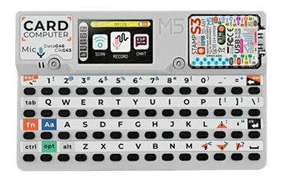
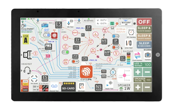
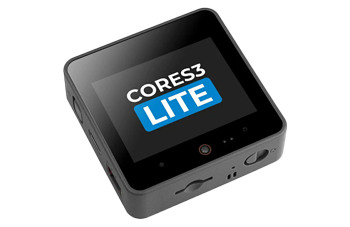
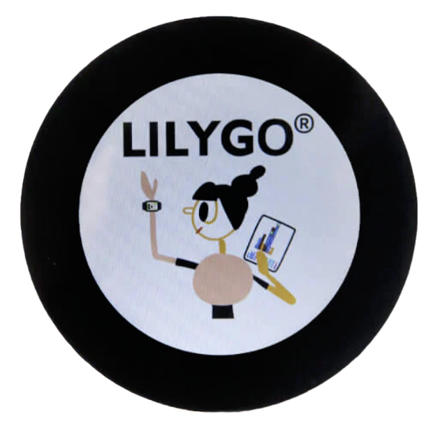

# LVGL Board Templates

A collection of ready-to-use LVGL templates and examples for various microcontroller boards from different manufacturers.

---

  If you like this, consider supporting it:

  
  

---

# 🧩 Supported boards

_Support by using the referral link below to purchase the board 🛍️ !_

---

 

 
  
<strong>🧩 WaveShare Boards (click to expand)</strong>

| 🛍️ Board | Image | Resolution | Chip | Flash/PSRAM | LVGL Version | Framework / IDE |
|--|--|--|--|--|--|--|
| [WaveShare 3.49"](https://s.click.aliexpress.com/e/_c3bE6ppN) |  | 640x172 | ESP32-S3 | 16MB / 8MB | 9.3.0 | PlatformIO |
| [WaveShare 1.47"](https://s.click.aliexpress.com/e/_c4F3cDgx) |  | 480×480 | ESP32-C6 | 4MB | 8.3.0 | ESP-IDF | 
| [WaveShare 4.3"](https://s.click.aliexpress.com/e/_c4aiCOWn) |  | 800x480 | ESP32-S3 | 16MB / 8MB | 8.4.0 | PlatformIO | 
| [WaveShare 1.54"](https://s.click.aliexpress.com/e/_c4aiCOWn) |  | 200x200 | ESP32-S3 | 8MB / 8MB | 8.4.0 | PlatformIO & ESP-IDF | 
| [WaveShare 1.47" S3 Tocuh](https://s.click.aliexpress.com/e/_c34yxe2Z) |  | 172x320 | ESP32-S3 | 8MB / 8MB | 8.4.0 |  ESP-IDF | 
| [WaveShare 1.85" Speaker Box](https://s.click.aliexpress.com/e/_c2xny4Ld) |  | 360x360 | ESP32-S3 | 16MB / 8MB | 8.3.x |  PlatformIO | 
| [WaveShare 1.8" Amodel](https://s.click.aliexpress.com/e/_c3ZDDLQR) |  | 368x448 | ESP32-S3 | 16MB / 8MB | 8.4.0 |  PlatformIO |
| [WaveShare 3.97" e-Paper](https://s.click.aliexpress.com/e/_c3cHby0X) |  | 800x480 | ESP32-S3 | 16MB / 8MB | 9.3.0 |  PlatformIO | 
| [WaveShare 4.2" RLCD](https://s.click.aliexpress.com/e/_c3QL8EGP) |  | 400x300 | ESP32-S3 | 16MB / 8MB | 9.3.0 |  PlatformIO |
| [WaveShare 1.75" AMOLED Round](https://s.click.aliexpress.com/e/_c4dR1lp5) |  | 466x466 | ESP32-S3 | 32MB / 8MB | 8.4.0 |  PlatformIO |
     

---

 

  
<strong>🧩 Elecrow Boards (click to expand)</strong>

| 🛍️ Board | Image | Resolution | Chip | Flash/PSRAM | LVGL Version | Framework / IDE |
|--|--|--|--|--|--|--|
| [CrowPanel Advance 2.4“](https://s.click.aliexpress.com/e/_c4nFay3N) |  | 320x240 | ESP32-S3 | 16MB / 8MB | 8.4.0 | PlatformIO |
| [CrowPanel Advance 2.1“](https://s.click.aliexpress.com/e/_c4qSokFb) |  | 480x480 | ESP32-S3 | 16MB / 8MB | 8.x / 9.x | PlatformIO |
| [CrowPanel Advance 1.28“](https://s.click.aliexpress.com/e/_c3UWSBDT) |  | 240x240 | ESP32-S3 | 16MB / 8MB | 8.x | PlatformIO |
| [CrowPanel Advance 10.1“](https://s.click.aliexpress.com/e/_c3J84Rfr) |  | 1024x600 | ESP32-P4 | 16MB / 32MB | 9.x | ESP-IDF |

---

 

  
<strong>🧩 Viewe Boards (click to expand)</strong>

| 🛍️ Board | Image | Resolution | Chip | Flash/PSRAM | LVGL Version | Framework / IDE |
|--|--|--|--|--|--|--|
| [VieweDisplay 1.5" Knob](https://s.click.aliexpress.com/e/_c4n95XyJ) |  | 466×466 | ESP32-S3 | 16MB / 8MB | 8.4.0 | PlatformIO |
| [VieweDisplay 2.1" Knob](https://s.click.aliexpress.com/e/_c3PRJgU3) |  | 480×480 | ESP32-S3 | 16MB / 8MB | 8.4.0 | PlatformIO | 

---

 

  
<strong>🧩 M5Stack Boards (click to expand)</strong>

| 🛍️ Board | Image | Resolution | Chip | Flash/PSRAM | LVGL Version | Framework / IDE |
|--|--|--|--|--|--|--|
| [CardPuter + ADV](https://s.click.aliexpress.com/e/_c3JAn5IJ) |  | 240x135 | ESP32-S3 | 8MB Flash / No PSRAM | 9.0.0 | PlatformIO |
| [Tab5](https://s.click.aliexpress.com/e/_c38WI04V) |  | 1280x720 | ESP32-P4 & ESP32-C6 | 16MB Flash / 32MB PSRAM | 8.3.11 | PlatformIO |
| [CoreS3](https://s.click.aliexpress.com/e/_c3CppBCt) |  | 320x240 | ESP32-S3 | 16MB Flash / 8MB PSRAM | 8.3.0 | PlatformIO |

---
 

  
<strong>🧩 Lilygo Boards (click to expand)</strong>

| 🛍️ Board | Image | Resolution | Chip | Flash/PSRAM | LVGL Version | Framework / IDE |
|--|--|--|--|--|--|--|
| [T-RGB](https://s.click.aliexpress.com/e/_c4mgHfh1) |  | 480x480 | ESP32-S3 | 16MB / 8MB | 8.x | PlatformIO |

---
 

  
<strong>🧩 SeeedStudio (click to expand)</strong>

| 🛍️ Board | Image | Resolution | Chip | Flash/PSRAM | LVGL Version | Framework / IDE |
|--|--|--|--|--|--|--|
| [reTerminal E1002](https://s.click.aliexpress.com/e/_c3J5v80z) |  | 800x480 | ESP32-S3 | 32MB / 8MB | 9.x | PlatformIO |

